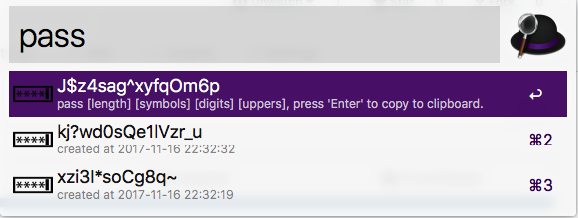

# alfred-password-generator

Use keyword `pass` to generate random password, with 4 optional parameters:

    pass [length] [symbols] [digits] [uppers]
    
* length: length of the password
* symbols: symbol letter count in password
* digits: digits count in password
* uppers: upper letters count in password

Recent generated passwords are also displayed in the list. You can use `passclear` to clear the list.

